# SharePoint 2013 Workflow Inventory

This repo helps you find and triage legacy SharePoint 2013 workflow app registrations before the retirement deadlines for SharePoint 2013 workflows and ACS-backed authentication.

The main goal is to identify `Workflow` app registrations in Entra ID, understand whether they still have usable credentials, check whether they have owners, and correlate them with sign-in activity so you can decide what must be migrated, disabled, or removed.

## What created them?

These app registrations are typically created automatically by SharePoint Online when legacy SharePoint 2013 workflows are published. In many tenants they appear in very large numbers, usually with the display name `Workflow`, and they often have no meaningful ownership or review history.



## What is in this repo?

- `SPO.ps1` inventories Entra ID app registrations whose name starts with `Workflow`.
- `SPO.kql` looks for recent sign-in activity tied to those workflow-related service principals and delegated flows.
- `workflow_app_registrations_landscape.svg` visualises the relationship between the workflow, the app registration, the service principal, the retirement dates, and the response steps.

## `SPO.ps1`

The PowerShell script connects to Microsoft Graph and exports a CSV inventory of matching app registrations.

It classifies each app by:

- credential state
- owner presence
- service principal presence
- age of the registration
- a simple risk tier

### Permissions

The script expects Microsoft Graph access with:

- `Application.Read.All`
- `Directory.Read.All`

The header comment in the script also notes that an Application Administrator role is sufficient for this read-only inventory scenario.

### Usage

```powershell
.\SPO.ps1
```

Optional parameters:

```powershell
.\SPO.ps1 -ExportPath .\WorkflowApps.csv
.\SPO.ps1 -SkipConnect
```

### Output

The CSV includes fields such as:

- `DisplayName`
- `AppId`
- `ObjectId`
- `CreatedDate`
- `AgeClassification`
- `CredentialStatus`
- `SoonestExpiry`
- `OwnerCount`
- `SPExists`
- `SPEnabled`
- `SPType`
- `RiskTier`

## `SPO.kql`

The KQL query is intended for Log Analytics or Sentinel-style investigation of workflow-related sign-ins.

It checks:

- `AADServicePrincipalSignInLogs` as the primary source for ACS and app/service principal token activity
- `AADNonInteractiveUserSignInLogs` for delegated workflow-related activity

The query uses a mix of name hints and SharePoint resource hints, then groups activity over a configurable lookback period and labels each app as recent, ageing, dormant, or inactive so you can prioritise remediation.

## Suggested workflow

1. Run `SPO.ps1` to build the inventory.
2. Use `SPO.kql` to see which registrations still show activity.
3. Prioritise apps with active credentials and no owners.
4. Confirm which workflows still matter to the business.
5. Migrate needed workflows or retire the unused ones.

## Notes

This repo is focused on discovery and triage. It does not migrate SharePoint 2013 workflows for you, but it gives you a practical starting point for finding the highest-risk legacy objects quickly.
